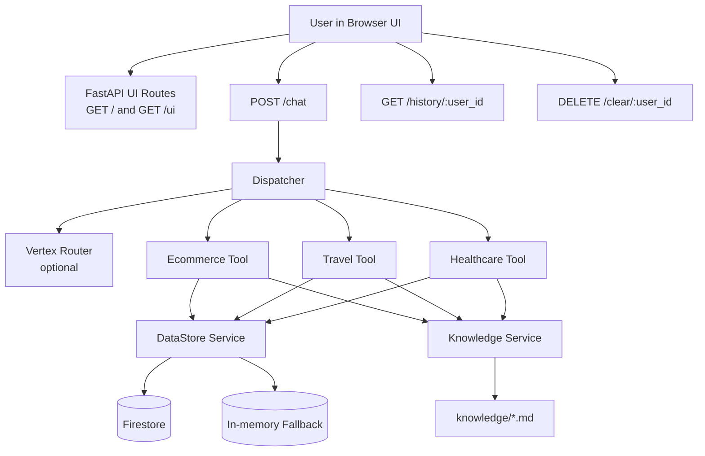
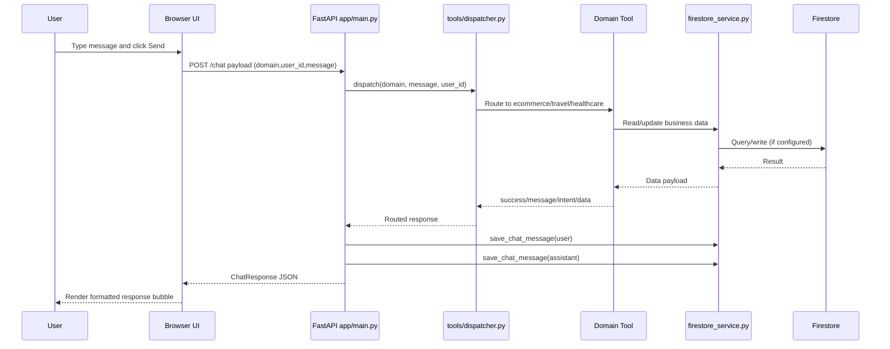

# Agentic Multi-Domain Assistant

FastAPI-based conversational assistant for Ecommerce, Travel, and Healthcare workflows. It combines domain routing, task-specific handlers, chat history persistence, and a built-in web UI.

## What This Project Does

- Routes incoming user messages to the right domain (auto or explicit)
- Executes domain-specific actions (orders, coupons, appointments, travel tasks)
- Stores and reloads chat history per user
- Uses Firestore in cloud mode, with in-memory fallback for local development
- Supports Vertex AI based routing when enabled

## Architecture



## End-to-End Request Flow



## Folder Layout

This README is at workspace root. App code is inside `ecommerce-assistant/`.

```
ecommerce-assistant/
  app/
    main.py
    models/schemas.py
    services/
      firestore_service.py
      knowledge_service.py
      vertex_service.py
    tools/
      dispatcher.py
      ecommerce.py
      travel.py
      healthcare.py
  knowledge/
    ecommerce.md
    travel.md
    healthcare.md
  scripts/
    seed_firestore.py
  requirements.txt
  Dockerfile
  Procfile
```

## Core Components

| Component | Path |
|---|---|
| API and UI layer | `ecommerce-assistant/app/main.py` |
| Routing engine | `ecommerce-assistant/app/tools/dispatcher.py` |
| Ecommerce handler | `ecommerce-assistant/app/tools/ecommerce.py` |
| Travel handler | `ecommerce-assistant/app/tools/travel.py` |
| Healthcare handler | `ecommerce-assistant/app/tools/healthcare.py` |
| Data layer | `ecommerce-assistant/app/services/firestore_service.py` |
| Knowledge lookup | `ecommerce-assistant/app/services/knowledge_service.py` |
| Vertex integration | `ecommerce-assistant/app/services/vertex_service.py` |

## Requirements

- Python 3.11+
- pip
- Optional GCP setup for Firestore and Vertex AI

## Environment Configuration

Copy and set values from `ecommerce-assistant/.env.example`:

```env
PROJECT_ID=agentic-ai-assistants-490311
REGION=asia-south1
MODEL_NAME=gemini-1.5-flash
USE_VERTEX_ROUTER=true
```

**Notes:**

- Set `USE_VERTEX_ROUTER=true` to enable Vertex-based domain routing
- If credentials are missing, the app can still run using in-memory fallback for data

## Local Run (PowerShell)

From workspace root:

```powershell
cd ecommerce-assistant
python -m venv .venv
.\.venv\Scripts\Activate.ps1
pip install -r requirements.txt
uvicorn app.main:app --reload --port 8000
```

Open:

- http://127.0.0.1:8000/
- http://127.0.0.1:8000/ui

## API Surface

| Method | Endpoint |
|---|---|
| GET | `/` |
| GET | `/ui` |
| POST | `/ui` |
| GET | `/health` |
| POST | `/chat` |
| GET | `/history/{user_id}` |
| DELETE | `/clear/{user_id}` |

## Business Behavior Notes

- **Cancel order** is safe by design:
  - Question style prompts like `"How do I cancel my order?"` return guidance only
  - Explicit commands like `"Cancel order 10234"` perform cancellation
- **Address update** supports natural language and can use latest order if no ID is provided
- **Coupon queries** support list, details, and apply guidance

## Sample Chat Payload

```json
{
  "domain": "auto",
  "user_id": "u1001",
  "message": "Show available coupons"
}
```

## Seed Demo Data (Optional)

```powershell
cd ecommerce-assistant
python scripts/seed_firestore.py
```

Seeds users, orders, coupons, doctors, flights, travel bookings, and appointments.

## Cloud Run Deployment

From workspace root:

```powershell
cd ecommerce-assistant
gcloud run deploy multi-domain-assistant \
  --source . \
  --region asia-south1 \
  --platform managed \
  --allow-unauthenticated \
  --project agentic-ai-assistants-490311 \
  --quiet
```

## Troubleshooting

| Symptom | Fix |
|---|---|
| Generic responses | Verify env vars and routing path |
| Firestore failures | Verify service account roles and project config |
| UI mismatch after changes | Redeploy and hard refresh browser |